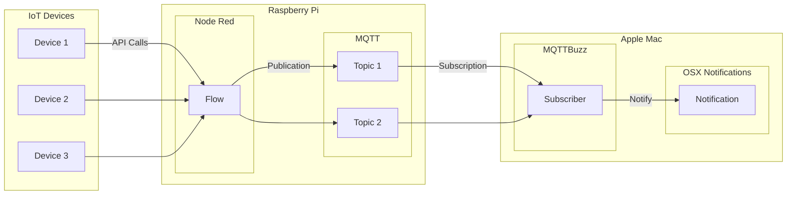

# Use Case for MQTTBuzz

MQTTBuzz is useful for publishing notifications from anthing that emits messages

A typical workflow is outlined in this diagram

In this case there are various IoT devices e.g. a thermostat which checks the ambient temperature, an oil tank holding heating fuel, a doorbell, etc.

In many cases, the user does not want to see the value all the time, only when a significant change happens. In our examples it is desirable to know:

 * Thermostat - when the temperature drops below a certail value
 * Oil Tank - when the level drops below a level
 * Doorbell - when it is pressed
 
Node-Red is used to monitor these events (e.g. read the temperature every hour and only report when it changes by more than 3 degrees)  and writes the alert to MQTT.

MQTTBuzz subscribes to the topic(s) for the alerts and publishes them on the Mac Desktop