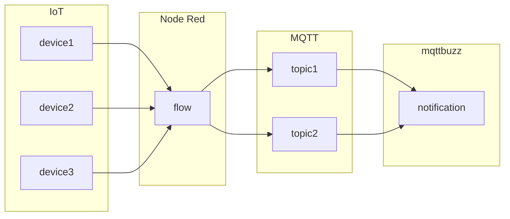

# Use Case for MQTTBuzz

```mermaid

graph LR
    subgraph iot [IoT]
       device1
       device2
       device3
    end
    subgraph nodered[Node Red]
       flow
    end
    subgraph mqtt[MQTT]
       topic1
       topic2
    end
    subgraph mqttbuzz
       notification
    end
    device1 --> flow
    device2 --> flow
    device3 --> flow
    flow --> topic1
    flow --> topic2
    topic1 --> notification
    topic2 --> notification
```
    

* Created using Mermaid Live https://mermaid.live